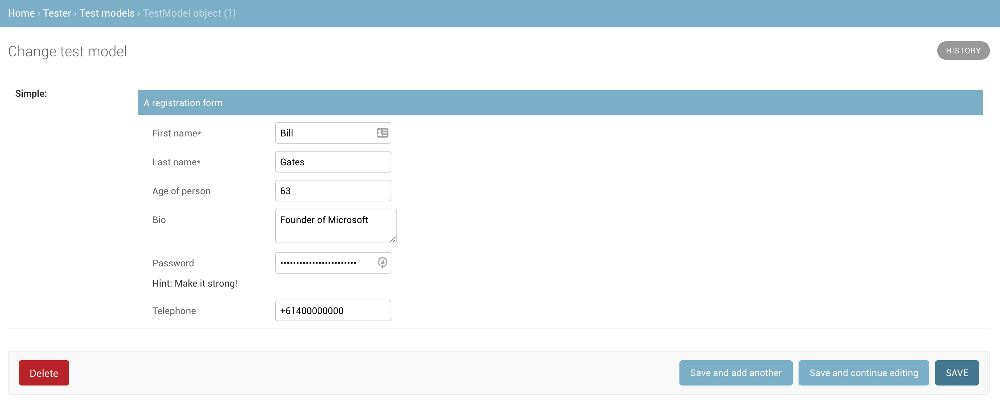

=============================
django-reactive
=============================

.. image:: https://badge.fury.io/py/django-reactive.svg
    :target: https://badge.fury.io/py/django-reactive

.. image:: https://github.com/tyomo4ka/django-reactive/workflows/CI/badge.svg?branch=master
    :target: https://github.com/tyomo4ka/django-reactive/actions

.. image:: https://codecov.io/gh/tyomo4ka/django-reactive/branch/master/graph/badge.svg
    :target: https://codecov.io/gh/tyomo4ka/django-reactive

django-reactive integrates `react-jsonschema-form <https://github.com/mozilla-services/react-jsonschema-form>`_ (RJSF)
in Django projects.

Motivation
----------

`JSON types <https://www.postgresql.org/docs/10/datatype-json.html>`_ is a cool feature of
Postgres that allows combining both relational and non-relational approaches to storing data together. In most cases
it would lead to a simpler database design.

The `JSONField  <https://docs.djangoproject.com/en/2.1/ref/contrib/postgres/fields/#jsonfield>`_ in Django provides a
nice way of integrating **json** and **jsonb** Postgres types inside the ORM. ORM can even utilise JSON fields
to perform database queries. **jsonb** type also offers indexing for JSON documents. That makes it a powerful
tool in the application design and opens a wide range of use cases, e.g. polymorphic behaviour, storing complex
hierarchies and lists of related entities.

However, the main limitation of JSONField in Django is that it does not offer a good way of managing such objects in
the default admin UI. Defining JSON objects inside the textarea is not practical for most use cases. django-reactive
tries to address this problem by offering an integration between JSONField and the awesome
`react-jsonschema-form <https://github.com/mozilla-services/react-jsonschema-form>`_ (RJSF) JavaScript library.
It also uses Python `jsonschema <https://github.com/Julian/jsonschema>` library for backend validation. Such integration
from our practice can significantly reduce an amount of work you need to do to build custom forms for JSONField types.

In most cases developers would only need to define a JSON schema configuration for such field and optionally UI schema
to modify UI for those forms.

A basic use case is demonstrated below:

.. code-block:: python

    from django.db import models

    from django_reactive.fields import ReactJSONSchemaField

    class Registration(models.Model):
        basic = ReactJSONSchemaField(
            help_text="Registration form",
            schema={
                "title": "Register now!",
                "description": "Fill out the form to register.",
                "type": "object",
                "required": [
                    "firstName",
                    "lastName"
                ],
                "properties": {
                    "firstName": {
                        "type": "string",
                        "title": "First name"
                    },
                    "lastName": {
                        "type": "string",
                        "title": "Last name"
                    },
                    "age": {
                        "type": "integer",
                        "title": "Age"
                    },
                    "bio": {
                        "type": "string",
                        "title": "Bio"
                    },
                    "password": {
                        "type": "string",
                        "title": "Password",
                        "minLength": 3
                    },
                    "telephone": {
                        "type": "string",
                        "title": "Telephone",
                        "minLength": 10
                    }
                }
            },
            ui_schema={
                "firstName": {
                    "ui:autofocus": True,
                    "ui:emptyValue": ""
                },
                "age": {
                    "ui:widget": "updown",
                    "ui:title": "Age of person",
                    "ui:description": "(earthian year)"
                },
                "bio": {
                    "ui:widget": "textarea"
                },
                "password": {
                    "ui:widget": "password",
                    "ui:help": "Hint: Make it strong!"
                },
                "date": {
                    "ui:widget": "alt-datetime"
                },
                "telephone": {
                    "ui:options": {
                        "inputType": "tel"
                    }
                }
            },
        )

It will generate a form like this:

Quick start
-----------

Install django-reactive::

    pip install django-reactive

Add it to your `INSTALLED_APPS`:

.. code-block:: python

    INSTALLED_APPS = (
        ...
        'django_reactive',
        ...
    )

Running the example
-------------------

Build the docker image for the Django application in `example/`:

* Run `docker-compose up -d`

This will automatically create the database, run migrations, import the default superuser, and run the Django development server on `http://127.0.0.1:8000`.

Django admin example
====================

* Open http://127.0.0.1:8000/admin/ and login with username `admin` and password `test`.
* Go to the "Test models" admin section to see the example forms.

Normal Django view example
==========================

* Open http://127.0.0.1:8000/create/ to create a basic form example.

You will be redirected to the detail view of the created object after the form saves.

Usage outside of Django admin
-----------------------------

To use outside of the Django admin, the following are required in the template:

* A call to the form media property using {{ form.media }}

* An HTML submit input with `name="_save"`.

.. code-block:: html

    <!DOCTYPE html>
    <html>
    <head>
      <title>Homepage</title>
    </head>
    <body>
      {{ form.media }}
      <form method="post">
        
        {{ form }}
        <input type="submit" value="Save" name="_save">
      </form>
    </body>
    </html>

Optional configuration
----------------------

Schema fields accept the following parameters for additional configuration:

* ``extra_css``: Include additional static CSS files available in the widget.
* ``extra_js``: Include additional static JavaScript files available in the widget.
* ``on_render``: A python method to make dynamic schema modifications at render-time.

Extra CSS and JSS files should be accessible using Django's staticfiles configurations and passed as a list of strings.

Render methods require both ``schema`` and ``ui_schema`` as arguments to allow dynamic schema modification when rendering the widget. An optional ``instance`` keyword argument may also be used for referencing an object instance (must be set on the widget in the form). This method does not return anything.

Example usage
=============

The example below demonstrates a use-case in which the options available for a particular field may be dynamic and unavailable in the initial schema definition. These would be populated at render-time and made available in the form UI.

.. code-block:: python

    def set_task_types(schema, ui_schema):
        from todos.models import TaskType

        task_types = list(TaskType.objects.all().values_list("name", flat=True))
        schema["definitions"]["Task"]["properties"]["task_type"]["enum"] = task_types
        ui_schema["task_lists"]["items"]["tasks"]["items"]["task_type"][
            "ui:help"
        ] = f"Select 1 of {len(task_types)} task types"

    class Todo(models.Model):
        """
        A collection of task lists for a todo.
        """

        name = models.CharField(max_length=255)
        task_lists = ReactJSONSchemaField(
            help_text="Task lists",
            schema=TODO_SCHEMA,
            ui_schema=TODO_UI_SCHEMA,
            on_render=set_task_types,
            extra_css=["css/extra.css"],
            extra_js=["js/extra.js"],
        )

Schema model form class
=======================

The form class ``ReactJSONSchemaModelForm`` (subclassed from Django's ``ModelForm``) can be used to provide the model form's instance object to the schema field widgets:

.. code-block:: python

    from django_reactive.forms import ReactJSONSchemaModelForm
    class MyModelForm(ReactJSONSchemaModelForm):
        ...

This allows the ``on_render`` method set for a schema field to reference the instance like this:

.. code-block:: python

    def update_the_schema(schema, ui_schema, instance=None):
        if instance and instance.some_condition:
            ui_schema["my_schema_prop"]["ui:help"] = "Some extra help text"

Features
--------

* React, RJSF and other JS assets are bundled with the package.
* Integration with default Django admin theme.
* Backend and frontend validation.
* Configurable static media assets
* Dynamic schema mutation in widget renders

Limitations
-----------

* `Additional properties <https://github.com/mozilla-services/react-jsonschema-form#expandable-option>`_ ( a feature of RJSF) is not supported.

To implement this behaviour you can define an array schema with one property serving as a key of the object and do
transformation in your JSON class. An example will be provided later.

Future development
------------------

* Display description as tooltips
* Polish styles and HTML generated by **RJSF**
